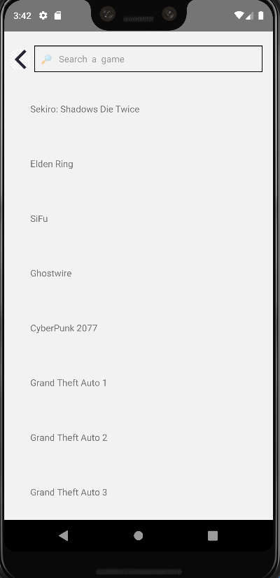

#Super Guide
---
*Version 1.0.0*
=


This is a respository for my Final Project at University of Regina CS455 class.

___Last Update 4/10/2022___

## Menu

1. [Configuration instructions](#Configuration-instructions)
2. [Installation instructions](#Installation-instructions)
3. [Operating instructions](#Operating-instructions)
4. [manifest](#manifest)
5. [Copyright information](#Copyright-information)
6. [Contact information](#Contact-information)
7. [Bug list](#Bug-list)
8. [Troubleshooting tips](#Troubleshooting-tips)
9. [Credits and acknowledgments](#Credits-and-acknowledgments)


## Configuration instructions
Super Guide apps may target iOS 10.0 and Android 9.0 (API 28) or newer. 

You can also access it by Expo using Windows, macOS, or Linux.
## Installation instructions
1. Google Expo snack 
2. Get into Expo snack website and create an account
3. Click on Snacks
4. Click on Create a New Snack and get into this Snack
5. Click on ⋮ from the project bar
6. Select import git repository 
7. Copy & Paste the following link: https://github.com/UofRJimmy/Cs455FinalProject.git
8. Click on Import respository
9. Problem Window: Click Update for all line
## Operating instructions
- There is a Search Bar and Some image of recent hot game under the search bar on the Home screen.

- User can either click on the image to access the guide content.


- Or click on the search bar to search the game they want.


- If user click on the search bar, the screen will navigate to search page.



- User can either input the name of the game to search the guide.


- Or scroll down the list to find the game they looking for.(you should click the keyword on the list to access the guide)


- There is a menu of each missions/level guide. The buttons on the menu having name on it. Find the missions/level you looking for and click on it.


- In the game guide page, the image can support the text and letting user to understand it faster.

.

## Manifest

```
- CyberPunk ----------> Game guide folder for the CyberPunk including all js file of CybePunk guide page and image
- Eldenring ----------> Game guide folder for the Eldenring including all js file of Eldenring guide page and image
- Sekiro ----------> Game guide folder for the Sekiro including all js file of Sekiro guide page and image
- SiFuGuide ----------> Game guide folder for the SiFu including all js file of SiFu guide page and image
- Ghostwire ----------> Game guide folder for the Ghostwire including all js file of Ghostwire guide page and image
- gamelist.json----> The file saving the page title and game name of the App
- externalSource ----------> The folder saving the original App screen js file
- UpdatingPage.js----------> The page that currently don't have any content
- ToDofile.txt ----> The list of the feature I should create in this app
- README.md ----> The file you are reading right now.
```

## Copyright information
@ Jimmy Lyu, University of Regina
## Contact information
- Jimmy Lyu cli863@uregina.ca
## Bug list
___No Bug___!

___No Bug___!!

___No Bug___!!!

😄 😄 😄
## Troubleshooting tips
Please send an email to me if you have any trouble
## Credits and acknowledgments
Instructor:Trevor
React-native develop team
ALI1213.NET
GoogleImage.ca
